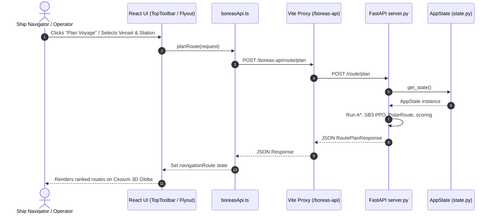
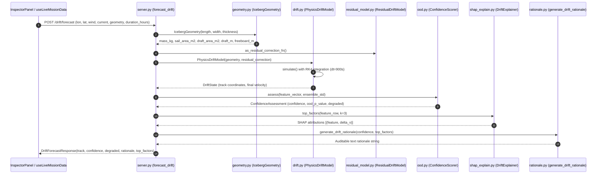
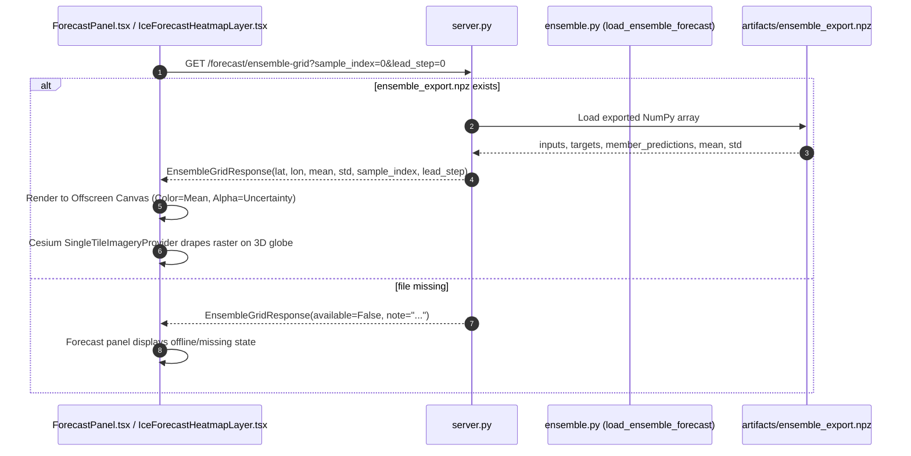
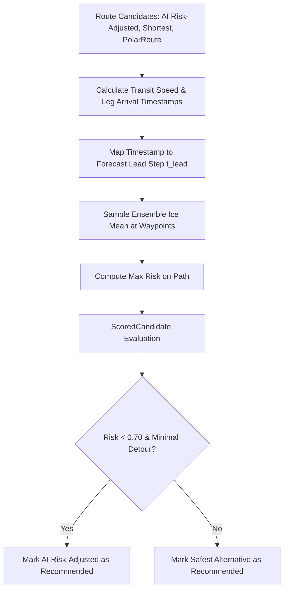
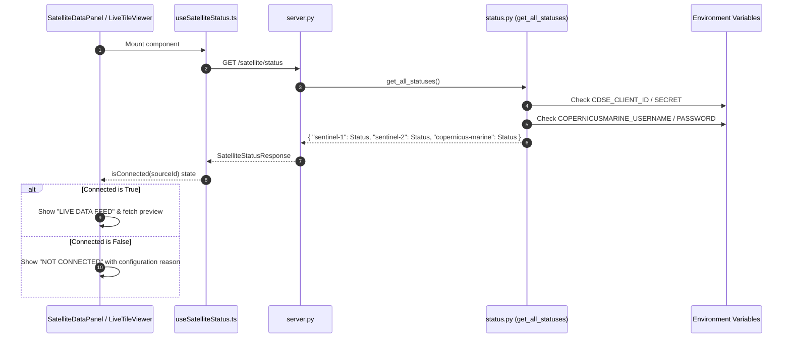
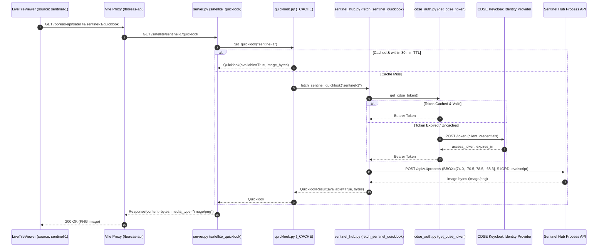
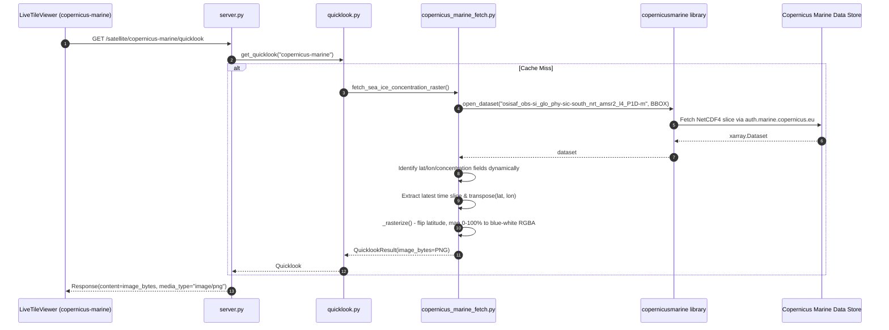
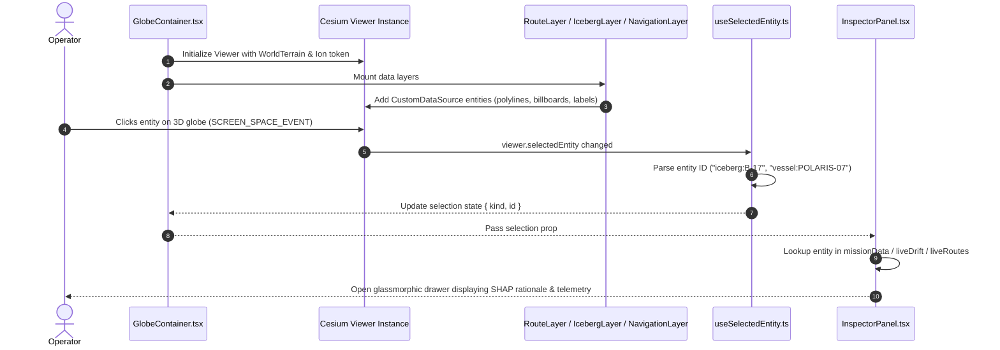
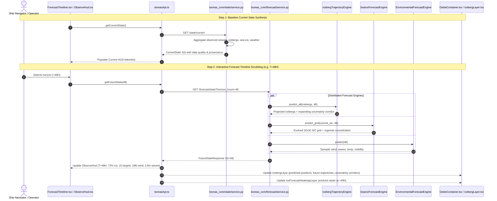

# BOREAS End-to-End Data Flows

This document details the critical data flows within BOREAS. For each flow, the complete lifecycle is mapped:
$$\text{Input} \longrightarrow \text{Transformation} \longrightarrow \text{Service/Module} \longrightarrow \text{API} \longrightarrow \text{Output} \longrightarrow \text{Consumer}$$

---

## 1. Flow Index

- [Flow A: User Interaction → Frontend → Backend → Response](#flow-a-user-interaction--frontend--backend--response)
- [Flow B: Route Planning & Multi-Option Navigation](#flow-b-route-planning--multi-option-navigation)
- [Flow C: Iceberg Tracking & Physics-Informed Drift Simulation](#flow-c-iceberg-tracking--physics-informed-drift-simulation)
- [Flow D: Sea-Ice Concentration & Deep-Ensemble Forecast](#flow-d-sea-ice-concentration--deep-ensemble-forecast)
- [Flow E: Weather & Environmental Forcing Flow](#flow-e-weather--environmental-forcing-flow)
- [Flow F: Along-Route Risk Calculation & Ranking](#flow-f-along-route-risk-calculation--ranking)
- [Flow G: Satellite Imagery Orchestration & Gating](#flow-g-satellite-imagery-orchestration--gating)
- [Flow H: Sentinel-1 SAR Quicklook Pipeline](#flow-h-sentinel-1-sar-quicklook-pipeline)
- [Flow I: Sentinel-2 Multispectral Optical Pipeline](#flow-i-sentinel-2-multispectral-optical-pipeline)
- [Flow J: Copernicus Marine Sea-Ice Concentration Raster](#flow-j-copernicus-marine-sea-ice-concentration-raster)
- [Flow K: CesiumJS 3D Virtual Globe Draping & Interaction](#flow-k-cesiumjs-3d-virtual-globe-draping--interaction)
- [Flow L: Level 02 Unified State & Prediction Engine Flow](#flow-l-level-02-unified-state--prediction-engine-flow)

---

## Flow A: User Interaction → Frontend → Backend → Response

- **Input**: User clicks/dropdown selections in `TopToolbar.tsx` or feature panels (`OverviewPanel.tsx`, `FusionPanel.tsx`).
- **Transformation**: Encapsulated into typed JSON payloads via `src/services/boreasApi.ts` (`postJson`, `getJson`).
- **Service/Module**: HTTP requests proxied via `frontend/vite.config.ts` (`/boreas-api` $\rightarrow$ `localhost:8000`).
- **API**: FastAPI endpoints in `boreas_core/api/server.py`.
- **Output**: Typed Pydantic models serialized to JSON.
- **Consumer**: React hooks (`useLiveMissionData`, `useEnsembleGrid`, `useSatelliteStatus`) update React component state and Cesium `CustomDataSource` entities.

---

## Flow B: Route Planning & Multi-Option Navigation

```mermaid
sequenceDiagram
    autonumber
    participant UI as TopToolbar.tsx
    participant API as server.py (plan_route)
    participant AStar as astar.py (astar_route)
    participant Policy as policy.py (AdaptiveRouter)
    participant Polar as polarroute_adapter.py (plan_polar_route)
    participant Score as scoring.py (rank_candidates)
    participant Directions as directions.py (build_route_legs)

    UI->>API: POST /route/plan (start, goal, hazards, speed_kt, include_polar_route)
    API->>API: Stamp hazards onto synthetic_southern_ocean_grid()
    
    rect rgb(20, 30, 45)
        note right of API: Candidate 1: AI Risk-Adjusted Route
        API->>Policy: router.plan(grid, start, goal)
        Policy->>AStar: astar_route(grid, start, goal, risk_weight=2.0)
        AStar-->>Policy: RouteResult
        Policy-->>API: RouteDecision
    end

    rect rgb(20, 30, 45)
        note right of API: Candidate 2: Shortest Path Baseline
        API->>AStar: astar_route(grid, start, goal, risk_weight=0.05)
        AStar-->>API: RouteResult (shortest)
    end

    rect rgb(20, 30, 45)
        note right of API: Candidate 3: PolarRoute Baseline (Optional)
        opt include_polar_route is True and Ensemble Export Available
            API->>Polar: plan_polar_route(start, goal, ice_mean, hazards)
            Polar-->>API: PolarRouteResult (MeshiPhi mesh + SDA ship model)
        end
    end

    API->>Score: time_aware_max_risk(legs, ensemble_forecast)
    API->>Score: rank_candidates([AI_Route, Shortest, PolarRoute])
    Score-->>API: [ScoredCandidate(recommended=True/False)]
    API->>Directions: build_route_legs(route)
    Directions-->>API: [RouteLegOut(bearing, compass_label, distance)]
    API-->>UI: RoutePlanResponse(options, warnings)
```

- **Input**: `start_lon`, `start_lat`, `goal_lon`, `goal_lat`, iceberg hazards (`hazard_lon`, `hazard_lat`, `hazard_radius_km`), `vessel_speed_kt` (default 12 kt), `include_polar_route: bool`.
- **Transformation**:
  1. `synthetic_southern_ocean_grid(seed=0)` creates a discrete `RiskGrid`.
  2. Circular hazard stamps applied for each tracked iceberg.
  3. `astar_route` generates the AI risk-adjusted path ($\text{risk\_weight}=2.0$) and naive shortest path ($\text{risk\_weight}=0.05$).
  4. If requested and `ensemble_export.npz` exists, `plan_polar_route` builds a MeshiPhi quadtree mesh from the ensemble forecast, simulates an SDA-class vessel fuel/traveltime profile, and solves a Dijkstra route.
  5. `time_aware_max_risk` evaluates each route's waypoints against the time-varying ensemble lead steps based on vessel transit ETA.
  6. `rank_candidates` sorts candidates by risk and distance, designating the single `recommended` path.
  7. `build_route_legs` computes compass bearings and turn-by-turn distance legs.
- **Service/Module**: `boreas_core/routing/` (`astar.py`, `grid.py`, `policy.py`, `polarroute_adapter.py`, `scoring.py`, `directions.py`).
- **API**: `POST /route/plan`.
- **Output**: `RoutePlanResponse` containing array of `RouteOptionOut` and warnings.
- **Consumer**: `RouteResultsPanel.tsx` (cards and leg list) and `NavigationLayer.tsx` (Cesium 3D polylines, arrows, and destination markers).

---

## Flow C: Iceberg Tracking & Physics-Informed Drift Simulation

- **Input**: Iceberg geographic position, wind velocity vector, ocean current vector, dimensions ($L \times W \times H$), forecast duration (e.g., 72 hours).
- **Transformation**:
  1. `IcebergGeometry` calculates draft and freeboard via hydrostatic Archimedean equilibrium ($\rho_{\text{ice}}=900 \text{ kg/m}^3, \rho_{\text{sw}}=1025 \text{ kg/m}^3$).
  2. `net_acceleration` balances quadratic air drag, quadratic water drag, and Coriolis deflection ($f = 2\Omega \sin \phi$).
  3. `ResidualDriftModel` predicts unmodelled Stokes drift and eddy current offsets via two XGBoost regressors.
  4. RK4 integration advances positions at 15-minute time steps ($\Delta t = 900\text{s}$) over a local tangent plane.
  5. `MahalanobisOODDetector` computes squared distance against the 11-dimensional training distribution and chi-square survival function $p$-value.
  6. `DriftExplainer` computes exact SHAP feature attributions via `TreeExplainer`.
  7. If degraded ($p < \text{threshold}$), deterministic fallback buffer replaces the forecast.
- **Service/Module**: `boreas_core/physics/`, `boreas_core/uncertainty/`, `boreas_core/explain/`.
- **API**: `POST /drift/forecast`.
- **Output**: `DriftForecastResponse` with projected track coordinates, confidence score, OOD $p$-value, degradation flag, and SHAP rationale.
- **Consumer**: `IcebergLayer.tsx` (drifting trajectory polylines, uncertainty ellipses) and `InspectorPanel.tsx`.

---

## Flow D: Sea-Ice Concentration & Deep-Ensemble Forecast

- **Input**: `sample_index` (int), `lead_step` (int).
- **Transformation**: `EnsembleForecast` extracts $(32 \times 32)$ spatial grid slices for ensemble mean and epistemic spread (standard deviation $\sigma$).
- **Service/Module**: `boreas_core/uncertainty/ensemble.py`.
- **API**: `GET /forecast/ensemble-grid` and `GET /forecast/ensemble-summary`.
- **Output**: Lat/lon grid vectors, 2D concentration mean matrix, 2D standard deviation matrix.
- **Consumer**: `IceForecastHeatmapLayer.tsx` renders onto an HTML5 Canvas and drapes onto the Cesium ellipsoid via `SingleTileImageryProvider`. Aggregate metrics are rendered in `ForecastPanel.tsx`.

---

## Flow E: Weather & Environmental Forcing Flow

- **Input**: Sea-surface winds ($u_{\text{wind}}, v_{\text{wind}}$) and ocean surface currents ($u_{\text{current}}, v_{\text{current}}$).
- **Transformation**: Currently sourced from climatological baseline constants (`CLIMATOLOGICAL_WIND = [10, 0] m/s`, `CLIMATOLOGICAL_CURRENT = [0.15, 0] m/s` representing prevailing Southern Ocean westerlies and the Antarctic Circumpolar Current in `frontend/src/hooks/useLiveMissionData.ts`).
- **Service/Module**: Injected as forcing vectors into `boreas_core/physics/drift.py` (`constant_forcing`).
- **API**: Parameters of `POST /drift/forecast`.
- **Output**: Direct dynamic force inputs to `net_acceleration`.
- **Consumer**: `PhysicsDriftModel`.

---

## Flow F: Along-Route Risk Calculation & Ranking

- **Input**: Route waypoint coordinates, estimated vessel speed ($V_{\text{vessel}}$), ensemble sea-ice forecast tensor.
- **Transformation**:
  1. For each leg, distance is calculated via spherical Haversine.
  2. Cumulative transit time yields estimated arrival time at each waypoint.
  3. Waypoint coordinates are indexed into `ENSEMBLE_GRID_LAT` / `ENSEMBLE_GRID_LON` at the corresponding forecast lead step ($t = 0 \dots 4$).
  4. `time_aware_max_risk` in `scoring.py` determines the maximum sea-ice concentration encountered along the entire route.
  5. `rank_candidates` prioritizes low risk ($< 70\%$) before minimizing distance/duration.
- **Service/Module**: `boreas_core/routing/scoring.py`.
- **API**: Internal module invoked within `POST /route/plan`.
- **Output**: Assigned `recommended: bool` attribute for each `RouteOptionOut`.
- **Consumer**: `RouteResultsPanel.tsx` highlights the recommended route card; `NavigationLayer.tsx` applies prominent glow shaders to it.

---

## Flow G: Satellite Imagery Orchestration & Gating

- **Input**: Component mount in `SatelliteDataPanel.tsx`.
- **Transformation**: `status.py` inspects `os.environ` without executing network requests.
- **Service/Module**: `boreas_core/satellite/status.py`.
- **API**: `GET /satellite/status`.
- **Output**: JSON dictionary mapping `source_id` to `{ connected: bool, reason: str }`.
- **Consumer**: `useSatelliteStatus.ts` hook gates tile requests. If disconnected, UI displays clean status badges rather than failed network requests.

---

## Flow H: Sentinel-1 SAR Quicklook Pipeline

- **Input**: Request for `sentinel-1` quicklook.
- **Transformation**:
  1. `get_cdse_token` fetches OAuth2 JWT bearer token via `CDSE_CLIENT_ID` / `CDSE_CLIENT_SECRET`.
  2. Bounding box fixed to Bharati Station / Prydz Bay (`[74.0°E, -70.5°S, 78.5°E, -68.3°S]`).
  3. Time filter set to rolling 14-day window (`mostRecent` mosaicking).
  4. Custom Javascript evalscript normalizes `VV` ($8\times$) and `VH` ($12\times$) cross-polarization channels into a 3-band false-color RGB.
  5. Sentinel Hub Process API renders a $512 \times 512$ PNG.
- **Service/Module**: `boreas_core/satellite/` (`sentinel_hub.py`, `cdse_auth.py`, `quicklook.py`).
- **API**: `GET /satellite/sentinel-1/quicklook`.
- **Output**: Binary PNG stream (`image/png`) or `503 Service Unavailable` with JSON diagnostic debug object.
- **Consumer**: `LiveTileViewer.tsx`, `TileModal.tsx`, and `sentinel-1/index.ts` (`SingleTileImageryProvider`).

---

## Flow I: Sentinel-2 Multispectral Optical Pipeline

- **Input**: Request for `sentinel-2` quicklook.
- **Transformation**:
  1. Identical CDSE Keycloak OAuth2 authentication as Flow H.
  2. Same Prydz Bay geographic bounding box (`[74.0, -70.5, 78.5, -68.3]`).
  3. Data collection: `S2L2A` (Bottom-Of-Atmosphere Level-2A reflectance).
  4. Custom Javascript evalscript extracts true-color bands `B04` (Red), `B03` (Green), `B02` (Blue), applying a $2.5\times$ gain multiplier.
  5. Process API produces a $512 \times 512$ true-color PNG.
- **Service/Module**: `boreas_core/satellite/sentinel_hub.py`.
- **API**: `GET /satellite/sentinel-2/quicklook`.
- **Output**: Binary PNG stream (`image/png`).
- **Consumer**: `LiveTileViewer.tsx`, `TileModal.tsx`, and `sentinel-2/index.ts`.

---

## Flow J: Copernicus Marine Sea-Ice Concentration Raster

- **Input**: Request for `copernicus-marine` quicklook.
- **Transformation**:
  1. `copernicusmarine.open_dataset` authenticates using `COPERNICUSMARINE_SERVICE_USERNAME` and `COPERNICUSMARINE_SERVICE_PASSWORD`.
  2. Pulls OSI-SAF AMSR2 L4 daily sea-ice concentration over Prydz Bay sector (`[60.0°E, -72.0°S, 95.0°E, -60.0°S]`).
  3. Dynamic variable inspection detects latitude, longitude, and concentration arrays regardless of schema naming variations.
  4. `_rasterize` inspects latitude sorting direction (flips rows if ascending south-to-north), normalizes concentration values ($0 \dots 100\%$), assigns dark blue ($[30, 60, 120]$) to open ocean, pure white ($[255, 255, 255]$) to pack ice, and sets transparent alpha ($0$) for land/no-data masks.
- **Service/Module**: `boreas_core/satellite/copernicus_marine_fetch.py`.
- **API**: `GET /satellite/copernicus-marine/quicklook`.
- **Output**: PNG image stream (`image/png`).
- **Consumer**: `LiveTileViewer.tsx`, `TileModal.tsx`, and `copernicus-marine/index.ts`.

---

## Flow K: CesiumJS 3D Virtual Globe Draping & Interaction

- **Input**: User camera navigation (pan/tilt/zoom) or entity click on the 3D globe.
- **Transformation**: Screen-space raycast converts pixel coordinate to 3D Cartesian WGS84 coordinates (`viewer.scene.pick`). Entity IDs (`iceberg:<id>`, `vessel:<id>`, `risk-cell:<id>`) parsed to domain records.
- **Service/Module**: `frontend/src/components/GlobeContainer.tsx`, `frontend/src/hooks/useSelectedEntity.ts`, `frontend/src/layers/`.
- **API**: Internal Cesium Event Loop (`ScreenSpaceEventHandler`).
- **Output**: Updated `selection` state driving `InspectorPanel.tsx`.
- **Consumer**: Ship navigation operator viewing real-time telemetry, confidence levels, and SHAP explainability.

---

## Flow L: Level 02 Unified State & Prediction Engine Flow

- **Input**: User selects a forecast stop (`NOW`, `+12H`, `+24H`, `+48H`, `+72H`, `+96H`, `+120H`) on the `ForecastTimeline.tsx`.
- **Transformation**: `useForecastState` queries `/forecast/state?horizon_hours=h` and `/forecast/icebergs`.
- **Engines**:
  - `IcebergTrajectoryEngine`: Kinematic integration with Coriolis drift and monotonic uncertainty corridor growth ($r(h) = r_0 + \alpha \cdot h^{1.14}$).
  - `SeaIceForecastEngine`: Deterministic spatial evolution with advection and thermodynamic consolidation.
  - `EnvironmentalForecastEngine`: Polar synoptic wave model predicting wind, wave height, temperature, pressure, visibility.
- **Output**: `FutureStateResponse` representing $X(t+h)$.
- **Consumer**: `IcebergLayer.tsx` moves iceberg beacons, renders glowing trajectory paths, and drapes translucent expanding uncertainty ellipses; `ObserveHud.tsx` updates forecast cards; `InspectorPanel.tsx` reveals predicted waypoints and uncertainty bounds.

