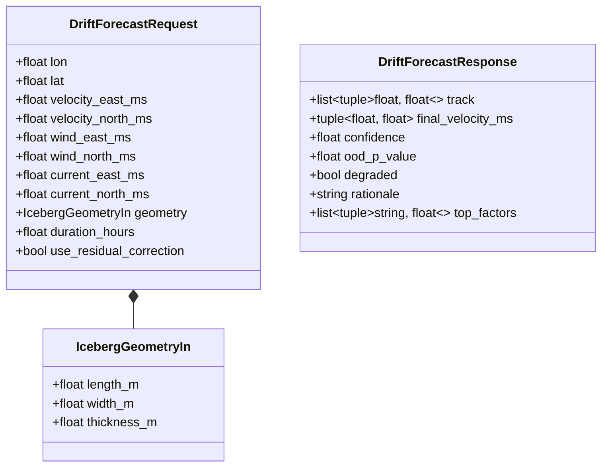
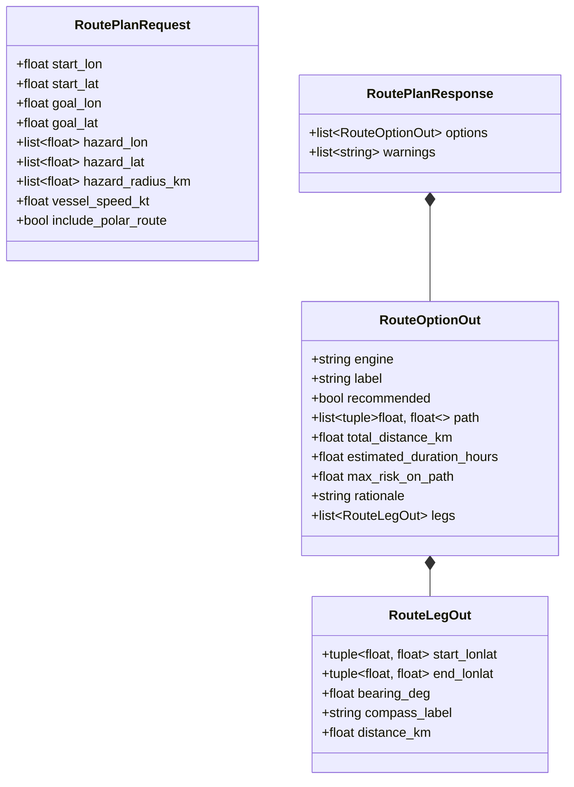

# BOREAS Data Model Specification

This document details the data models, Pydantic DTOs, domain dataclasses, NumPy multidimensional array structures, and client-side TypeScript types used across BOREAS.

---

## 1. Data Modeling Architecture

BOREAS operates primarily on **in-memory domain models and serialized JSON DTOs** rather than a relational SQL schema. State and computation rely on:
1. **Pydantic V2 Schemas**: Strict API boundary serialization, validation, and schema generation (`boreas_core/api/schemas.py`).
2. **Python Dataclasses**: Domain structures representing physical geometry, drift states, route candidates, and uncertainty scores (`boreas_core/physics/`, `routing/`, `uncertainty/`).
3. **NumPy Arrays & Tensors**: High-dimensional numerical matrices for RK4 drift trajectories, spatial risk grids, and deep-ensemble sea-ice predictions.
4. **TypeScript Interfaces**: Frontend client-side representations mirroring API contracts and UI states (`frontend/src/services/boreasApi.ts`, `data/`).

---

## 2. Pydantic API Data Transfer Objects (DTOs)

### 2.1 Iceberg Drift Forecasting



- **`IcebergGeometryIn`**: Validates strictly positive iceberg dimensions (`gt=0`).
- **`DriftForecastRequest`**: Validates start coordinates, forcing velocities, geometry, and duration ($0 < \text{duration} \le 240$ hours).
- **`DriftForecastResponse`**: Encapsulates the simulated track waypoints, terminal velocity vector, fused confidence ($0 \dots 1$), chi-square OOD $p$-value, degradation flag, auditable natural language rationale, and top SHAP feature attributions.

### 2.2 Route Planning & Navigation



- **`RoutePlanRequest`**: Inputs vessel origin, destination, circular hazard definitions, vessel speed (default 12 kt), and PolarRoute inclusion flag.
- **`RouteLegOut`**: Step-by-step navigation segment containing coordinates, initial compass bearing ($0^\circ \dots 360^\circ$), 16-point cardinal compass label, and segment distance.
- **`RouteOptionOut`**: Full candidate route with designated engine (`boreas_ai_risk_adjusted`, `boreas_ai_shortest`, `polar_route`), recommended flag, trajectory path, distance, duration, along-route maximum risk, and rationale.

### 2.3 Uncertainty & Forecaster Models

- **`EnsembleSummaryResponse`**:
  - `available: bool`
  - `n_members: int`
  - `mean_ensemble_std: float`
  - `max_ensemble_std: float`
  - `ensemble_mae_vs_truth: float`
  - `best_single_member_mae_vs_truth: float`
  - `note: str`
- **`EnsembleGridResponse`**:
  - `available: bool`
  - `lat: list[float]` (32 coordinate points from $-90^\circ$ to $+90^\circ$)
  - `lon: list[float]` (32 coordinate points from $-180^\circ$ to $+180^\circ$)
  - `mean: list[list[float]]` ($32 \times 32$ sea-ice concentration mean matrix)
  - `std: list[list[float]]` ($32 \times 32$ sea-ice concentration spread matrix)
  - `sample_index: int`, `lead_step: int`

### 2.4 Vessel Fleet & AIS Telemetry

- **`VesselOut`**:
  - `id: str`: Unique identifier (e.g. `vasiliy_golovnin`).
  - `name: str`: Display vessel name.
  - `imo: str | None`: International Maritime Organization registration number.
  - `mmsi: str | None`: Maritime Mobile Service Identity.
  - `vessel_type: str`: Hull classification.
  - `home_port: str`: Staging city.
  - `assigned_station_ids: list[str]`: Station codes (e.g. `["bharati", "maitri"]`).
  - `active: bool`: Whether the vessel is currently in polar service.
  - `status: str`: `LIVE — terrestrial AIS`, `BEYOND AIS RANGE`, or `NOT CONNECTED`.
  - `lon: float`, `lat: float`: Current or last known geographic position.
  - `note: str`: Citation or status provenance.

---

## 3. Core Domain Dataclasses

### 3.1 Physics & Geometry
- **`IcebergGeometry` (`physics/geometry.py`)**:
  - Parameters: `length_m: float`, `width_m: float`, `thickness_m: float`, `rho_ice = 900.0`, `rho_seawater = 1025.0`.
  - Computed Properties:
    - `draft_m`: Submerged depth via Archimedes balance ($\text{thickness} \times \frac{\rho_{\text{ice}}}{\rho_{\text{sw}}}$).
    - `freeboard_m`: Height above waterline.
    - `mass_kg`: $\rho_{\text{ice}} \times L \times W \times H$.
    - `sail_area_m2`: Cross-sectional sail area exposed to wind ($W \times \text{freeboard}$).
    - `draft_area_m2`: Cross-sectional keel area exposed to current ($W \times \text{draft}$).
- **`DriftState` (`physics/drift.py`)**:
  - `time_s: np.ndarray`: Array of elapsed seconds.
  - `lon: np.ndarray`, `lat: np.ndarray`: Integrated coordinate arrays.
  - `velocity: np.ndarray`: $(N, 2)$ matrix of $[u_{\text{east}}, v_{\text{north}}]$ velocities.

### 3.2 Machine Learning Feature Vector
The residual model (`ResidualDriftModel`), SHAP explainer (`DriftExplainer`), and OOD detector (`MahalanobisOODDetector`) share a strict 11-column feature specification:
```python
FEATURE_COLUMNS = [
    "physics_vel_east",   # Physical model velocity East (m/s)
    "physics_vel_north",  # Physical model velocity North (m/s)
    "wind_east",          # Atmospheric wind East (m/s)
    "wind_north",         # Atmospheric wind North (m/s)
    "current_east",       # Ocean surface current East (m/s)
    "current_north",      # Ocean surface current North (m/s)
    "latitude",           # Geographic latitude (deg)
    "length_m",           # Iceberg length (m)
    "width_m",            # Iceberg width (m)
    "thickness_m",        # Iceberg thickness (m)
    "sail_area_m2",       # Wind exposure area (m^2)
    "draft_area_m2",      # Current exposure area (m^2)
]
```

### 3.3 Routing Domain Structures
- **`RiskGrid` (`routing/grid.py`)**:
  - `bounds: tuple[float, float, float, float]`: $[W, S, E, N]$.
  - `shape: tuple[int, int]`: Rows and columns.
  - `risk: np.ndarray`: 2D matrix of cell hazard values $[0.0, 1.0]$.
- **`RouteResult` (`routing/astar.py`)**:
  - `path_cells: list[tuple[int, int]]`: Grid cell indices.
  - `path_lonlat: list[tuple[float, float]]`: Geographic coordinate sequence.
  - `total_distance_km: float`: Summed Haversine distance.
  - `total_cost: float`: Risk-weighted objective function value.
  - `max_risk_on_path: float`: Peak hazard value along route.

---

## 4. External Data Structures

- **Copernicus Marine NetCDF4**:
  - Dimensions: `time`, `lat` / `latitude`, `lon` / `longitude`.
  - Variables: `ice_conc` (percentage $0 \dots 100$), masked with NaN over land.
- **Deep-Ensemble Export (`ensemble_export.npz`)**:
  - `inputs`: Tensor of shape $(N, T_{\text{history}}, C, H, W)$.
  - `targets`: Tensor of shape $(N, T_{\text{forecast}}, C, H, W)$.
  - `member_predictions`: Tensor of shape $(M_{\text{members}}, N, T, C, H, W)$.
  - `ensemble_mean`: Aggregated mean $(N, T, C, H, W)$.
  - `ensemble_std`: Epistemic standard deviation $(N, T, C, H, W)$.
- **VesselAPI JSON**:
  - Fields: `imo`, `latitude`, `longitude`, `timestamp`, `speed`, `heading`.
