# BOREAS Frontend Architecture (`frontend`)

This document details the architecture, component hierarchy, state management, and CesiumJS geospatial integration of the BOREAS frontend application.

---

## 1. Directory Structure

```
frontend/
├── index.html                  # HTML entry point with Cesium root container
├── package.json                # Dependencies: React 19, Cesium 1.145, Vite 8
├── vite.config.ts              # Vite config, Cesium plugin, and /boreas-api proxy
├── tsconfig.json               # TypeScript base config
├── tsconfig.app.json           # Application TS rules (strict: true)
├── public/
│   ├── assets/satellite/       # Static preview imagery assets
│   ├── favicon.svg             # App favicon
│   └── icons.svg               # SVG sprite definitions
└── src/
    ├── main.tsx                # Application bootstrap
    ├── App.tsx                 # Root layout & component coordinator
    ├── index.css               # Global glassmorphism stylesheet & CSS design system
    ├── assets/                 # Brand assets
    ├── data/                   # Client-side static mission metadata & checkpoints
    │   ├── checkpoints.ts      # Antarctic research stations (Bharati, Maitri, etc.)
    │   └── missionData.ts      # Static fallback icebergs, vessels, and risk cells
    ├── types/
    │   └── selection.ts        # Selection entity union types
    ├── services/               # API clients & status polling
    │   ├── backendStatus.ts    # Polling hook for /boreas-api/health
    │   └── boreasApi.ts        # Typed client for all boreas-core REST endpoints
    ├── hooks/                  # Custom React hooks
    │   ├── useCameraState.ts   # Tracks Cesium camera position, altitude, and tilt
    │   ├── useEnsembleGrid.ts  # Fetches 32x32 deep-ensemble forecast grid
    │   ├── useLiveMissionData.ts # Background poll for drift & route updates
    │   ├── useSatelliteStatus.ts # Gated satellite connectivity statuses
    │   └── useSelectedEntity.ts # Bi-directional Cesium entity selection sync
    ├── layers/                 # CesiumJS geospatial layer components
    │   ├── IcebergLayer.tsx    # Renders icebergs, drift vectors, and uncertainty cones
    │   ├── IceConcentrationLayer.tsx # Renders background ice zones & risk cells
    │   ├── IceForecastHeatmapLayer.tsx # Drapes 32x32 ensemble forecast canvas
    │   ├── NavigationLayer.tsx # Renders voyage planner multi-route options & legs
    │   ├── RouteLayer.tsx      # Renders always-on polled vessel routes & corridors
    │   ├── shared/             # Shared layer contracts
    │   │   ├── LayerRegistry.ts # Registry of all Earth Observation tile sources
    │   │   └── LayerSource.ts  # Interface definition for satellite tile sources
    │   ├── copernicus-marine/  # Copernicus Marine OSI-SAF provider definition
    │   ├── nasa-worldview/     # NASA GIBS WMTS imagery provider definition
    │   ├── sentinel-1/         # Sentinel-1 SAR quicklook provider definition
    │   └── sentinel-2/         # Sentinel-2 optical quicklook provider definition
    └── components/             # React UI components
        ├── GlobeContainer.tsx  # Cesium Viewer lifecycle & layer mounting
        ├── GlobeControls.tsx   # Compass, zoom, tilt, and home controls
        ├── StatusBar.tsx       # Bottom HUD displaying coordinates, altitude, UTC
        ├── TopToolbar.tsx      # Google-Earth-Pro-style navigation & search bar
        ├── FlyoutPanel.tsx     # Left-hand tabbed slide-out drawer
        ├── InspectorPanel.tsx  # Right-hand selection detail & SHAP rationale dock
        ├── RouteResultsPanel.tsx # Right-hand voyage options & turn-by-turn legs
        ├── SatelliteDataPanel.tsx # Bottom dock for live Earth observation tiles
        ├── LiveTileViewer.tsx  # Preview card for satellite tile streams
        ├── TileModal.tsx       # Full-detail zoomable modal for satellite tiles
        ├── MiniMap.tsx         # Polar stereographic overview mini-map
        ├── LayerTogglePanel.tsx # Visibility checkboxes for globe layers
        └── panels/             # Flyout sub-panels
            ├── ConfidenceBar.tsx # Visual progress meter for confidence/risk
            ├── EdgeAIPanel.tsx # Tiny vs edge-target distillation metrics
            ├── ForecastPanel.tsx # Deep-ensemble summary & layer toggling
            ├── FusionPanel.tsx # Bayesian Indian data fusion interactive demo
            └── OverviewPanel.tsx # Platform introduction & MoES problem overview
```

---

## 2. Component Hierarchy

```mermaid
graph TD
    App[App.tsx]
    
    App --> GlobeContainer[GlobeContainer.tsx]
    GlobeContainer --> CesiumViewer[CesiumJS Viewer]
    CesiumViewer --> IcebergLayer[IcebergLayer.tsx]
    CesiumViewer --> RouteLayer[RouteLayer.tsx]
    CesiumViewer --> NavigationLayer[NavigationLayer.tsx]
    CesiumViewer --> IceForecastHeatmapLayer[IceForecastHeatmapLayer.tsx]
    CesiumViewer --> IceConcentrationLayer[IceConcentrationLayer.tsx]

    App --> TopToolbar[TopToolbar.tsx]
    TopToolbar --> VoyageSearch[Inline Voyage Planner Search]
    TopToolbar --> NavIcons[Feature Panel Icon Strip]
    TopToolbar --> BackendBadge[Backend Status Badge]

    App --> FlyoutPanel[FlyoutPanel.tsx]
    FlyoutPanel --> OverviewPanel[OverviewPanel.tsx]
    FlyoutPanel --> LayerTogglePanel[LayerTogglePanel.tsx]
    FlyoutPanel --> ForecastPanel[ForecastPanel.tsx]
    FlyoutPanel --> FusionPanel[FusionPanel.tsx]
    FlyoutPanel --> EdgeAIPanel[EdgeAIPanel.tsx]

    App --> InspectorPanel[InspectorPanel.tsx]
    InspectorPanel --> ConfidenceBar[ConfidenceBar.tsx]

    App --> RouteResultsPanel[RouteResultsPanel.tsx]

    App --> SatelliteDataPanel[SatelliteDataPanel.tsx]
    SatelliteDataPanel --> LiveTileViewer[LiveTileViewer.tsx]
    SatelliteDataPanel --> TileModal[TileModal.tsx]

    App --> GlobeControls[GlobeControls.tsx]
    App --> StatusBar[StatusBar.tsx]
```



---

## 3. State Management

The frontend uses **React Context-free local and lifted hook state**. State is organized cleanly by domain:

| State Variable | Hook / Component | Description |
|---|---|---|
| `activeTab` | `App.tsx` | Controls which feature panel is open in `FlyoutPanel` (`home`, `layers`, `forecast`, `fusion`, `edge`, `settings`). Empty string means closed. |
| `selection` | `useSelectedEntity` | Tracks clicked object: `{ kind: 'iceberg' \| 'vessel' \| 'risk-cell', id: string }`. Synchronized with Cesium `viewer.selectedEntity`. |
| `layerVisibility` | `App.tsx` | Boolean toggles for `icebergs`, `ice`, `risk`, `routes`, and `forecast`. |
| `navigationRoute` | `App.tsx` | Active voyage plan holding vessel, checkpoint destination, array of `RouteOption`s, selected option index, and warnings. |
| `liveDrift` | `useLiveMissionData` | Dictionary of live drift forecast responses keyed by iceberg ID. Polled every 60 seconds. |
| `liveRoutes` | `useLiveMissionData` | Dictionary of live route plan responses keyed by vessel ID. Polled every 60 seconds. |
| `ensembleGrid` | `useEnsembleGrid` | 2D matrices of sea-ice concentration mean and uncertainty standard deviation. |
| `statuses` | `useSatelliteStatus` | Connectivity status dictionary for credential-gated satellite feeds (`sentinel-1`, `sentinel-2`, `copernicus-marine`). |
| `backendState` | `useBackendStatus` | Health probe state (`checking`, `online`, `offline`) polled every 15 seconds against `/boreas-api/health`. |
| `cameraState` | `useCameraState` | Real-time latitude, longitude, altitude, heading, pitch, and roll read from `viewer.camera`. |

---

## 4. CesiumJS 3D Globe Integration

### 4.1 Viewer Initialization (`GlobeContainer.tsx`)
- Instantiated on an unstyled `<div>` reference.
- **Terrain Provider**: `Terrain.fromWorldTerrain()` loaded using `VITE_CESIUM_ION_TOKEN`.
- **Default Camera Configuration**:
  ```typescript
  viewer.camera.setView({
    destination: Cartesian3.fromDegrees(0, -82, 9200000),
    orientation: {
      heading: CesiumMath.toRadians(0),
      pitch: CesiumMath.toRadians(-85),
      roll: 0,
    },
  });
  ```
- **Optimizations**: Disables stock widgets (`animation`, `timeline`, `geocoder`, `homeButton`, `baseLayerPicker`, `infoBox`, `selectionIndicator`) to provide a sleek, custom military/operational UI.

### 4.2 Geospatial Layer Implementations
1. **`IcebergLayer`**:
   - Manages a Cesium `CustomDataSource('icebergs')`.
   - Renders historical tracks via `PolylineDashMaterialProperty`.
   - Renders live physics forecast tracks via `PolylineGlowMaterialProperty` (colored red if degraded, cyan if normal).
   - Renders uncertainty ellipses (`semiMajorAxis`, `semiMinorAxis`) oriented along the iceberg's heading.
   - Places 3D billboard beacons and mono-spaced labels.
2. **`RouteLayer`**:
   - Manages `CustomDataSource('routes')`.
   - Renders vessel paths with dynamic glowing polylines.
   - Renders semi-transparent confidence corridors whose width scales inversely with model confidence:
     $$\text{corridor\_width} = 60000 \times (1.6 - \text{confidence}) \text{ meters}$$
   - Places directional ship icons rendered from an HTML5 canvas.
3. **`NavigationLayer`**:
   - Manages `CustomDataSource('navigation-route')`.
   - Draws alternative candidate routes in dimmed grey dashed polylines.
   - Draws the selected/recommended route in glowing cyan/red, rendering every intermediate waypoint and true compass bearing arrows computed via local East-North-Up ($ENU$) tangent matrix transformations:
     $$\mathbf{d}_{\text{world}} = \mathbf{R}_{\text{ENU}} \begin{pmatrix} \sin \theta \\ \cos \theta \\ 0 \end{pmatrix}$$
4. **`IceForecastHeatmapLayer`**:
   - Dynamically draws the $32 \times 32$ deep-ensemble forecast onto an offscreen canvas.
   - Corrects for latitude orientation inversion (canvas top edge is North, whereas grid row 0 is South).
   - Drapes the generated data URL onto the globe as a single `SingleTileImageryProvider` across $[-180^\circ, -90^\circ, 180^\circ, 90^\circ]$.

---

## 5. UI Design & Styling Philosophy

- **Theme**: High-contrast, dark-mode polar operational command center.
- **Color Palette**: Curated HSL/Hex tokens:
  - Background deep void: `#040a10`
  - Glassmorphic panels: `rgba(6, 17, 26, 0.78)` with `backdrop-filter: blur(16px)`
  - Ice & drift cyan: `#8ce8ff`, `#22d3ee`
  - Safe navigation green: `#4ade80`
  - Caution / guarded amber: `#f5ce69`, `#fbbf24`
  - Critical hazard / degraded red: `#f87171`
- **Typography**: Google Fonts `Inter` for interface labels; `DM Mono` for numerical telemetry, bearings, coordinates, and timestamps.
- **Responsiveness**: Flexible panel layouts, sliding flyouts, and collapsible docks accommodating desktop operational monitors down to field laptop screens.
