# BOREAS Frontend Architecture (`frontend`)

This document details the architecture, component hierarchy, state management, and CesiumJS geospatial integration of the BOREAS frontend application.

---

## 1. Directory Structure

```
frontend/
├── index.html                  # HTML entry point with Cesium root container
├── package.json                # Dependencies: React 19, Cesium 1.145, Vite 8
├── vite.config.ts              # Vite config, Cesium plugin, and /boreas-api proxy
├── tsconfig.json               # TypeScript base config
├── tsconfig.app.json           # Application TS rules (strict: true)
├── public/
│   ├── assets/satellite/       # Static preview imagery assets
│   ├── favicon.svg             # App favicon
│   └── icons.svg               # SVG sprite definitions
└── src/
    ├── main.tsx                # Application bootstrap
    ├── App.tsx                 # Root layout & component coordinator
    ├── index.css               # Global glassmorphism stylesheet & CSS design system
    ├── assets/                 # Brand assets
    ├── data/                   # Client-side static mission metadata & checkpoints
    │   ├── checkpoints.ts      # Antarctic research stations (Bharati, Maitri, etc.)
    │   └── missionData.ts      # Static fallback icebergs, vessels, and risk cells
    ├── types/
    │   └── selection.ts        # Selection entity union types
    ├── services/               # API clients & status polling
    │   ├── backendStatus.ts    # Polling hook for /boreas-api/health
    │   └── boreasApi.ts        # Typed client for all boreas-core REST endpoints
    ├── hooks/                  # Custom React hooks
    │   ├── useCameraState.ts   # Tracks Cesium camera position, altitude, and tilt
    │   ├── useEnsembleGrid.ts  # Fetches 32x32 deep-ensemble forecast grid
    │   ├── useLiveMissionData.ts # Background poll for drift & route updates
    │   ├── useSatelliteStatus.ts # Gated satellite connectivity statuses
    │   └── useSelectedEntity.ts # Bi-directional Cesium entity selection sync
    ├── layers/                 # CesiumJS geospatial layer components
    │   ├── IcebergLayer.tsx    # Renders icebergs, drift vectors, and uncertainty cones
    │   ├── IceConcentrationLayer.tsx # Renders background ice zones & risk cells
    │   ├── IceForecastHeatmapLayer.tsx # Drapes 32x32 ensemble forecast canvas
    │   ├── NavigationLayer.tsx # Renders voyage planner multi-route options & legs
    │   ├── RouteLayer.tsx      # Renders always-on polled vessel routes & corridors
    │   ├── shared/             # Shared layer contracts
    │   │   ├── LayerRegistry.ts # Registry of all Earth Observation tile sources
    │   │   └── LayerSource.ts  # Interface definition for satellite tile sources
    │   ├── copernicus-marine/  # Copernicus Marine OSI-SAF provider definition
    │   ├── nasa-worldview/     # NASA GIBS WMTS imagery provider definition
    │   ├── sentinel-1/         # Sentinel-1 SAR quicklook provider definition
    │   └── sentinel-2/         # Sentinel-2 optical quicklook provider definition
    └── components/             # React UI components
        ├── GlobeContainer.tsx  # Cesium Viewer lifecycle & layer mounting
        ├── GlobeControls.tsx   # Compass, zoom, tilt, and home controls
        ├── StatusBar.tsx       # Bottom HUD displaying coordinates, altitude, UTC
        ├── TopToolbar.tsx      # Google-Earth-Pro-style navigation & search bar
        ├── FlyoutPanel.tsx     # Left-hand tabbed slide-out drawer
        ├── InspectorPanel.tsx  # Right-hand selection detail & SHAP rationale dock
        ├── RouteResultsPanel.tsx # Right-hand voyage options & turn-by-turn legs
        ├── SatelliteDataPanel.tsx # Bottom dock for live Earth observation tiles
        ├── LiveTileViewer.tsx  # Preview card for satellite tile streams
        ├── TileModal.tsx       # Full-detail zoomable modal for satellite tiles
        ├── MiniMap.tsx         # Polar stereographic overview mini-map
        ├── LayerTogglePanel.tsx # Visibility checkboxes for globe layers
        └── panels/             # Flyout sub-panels
            ├── ConfidenceBar.tsx # Visual progress meter for confidence/risk
            ├── EdgeAIPanel.tsx # Tiny vs edge-target distillation metrics
            ├── ForecastPanel.tsx # Deep-ensemble summary & layer toggling
            ├── FusionPanel.tsx # Bayesian Indian data fusion interactive demo
            └── OverviewPanel.tsx # Platform introduction & MoES problem overview
```

---

## 1a. Mission Experience (primary application)

> [!IMPORTANT]
> `App.tsx` renders the **mission experience**: a three-phase captain workflow over a single
> persistent Cesium globe. The Google-Earth-style explorer components (`GlobeContainer`,
> `TopToolbar`, `ObserveHud`, `FlyoutPanel`, `SatelliteDataPanel`, `InspectorPanel`,
> `RouteResultsPanel`, `ForecastTimeline`, `MiniMap`, `StatusBar`, `GlobeControls`) and their
> layers remain in the repository unchanged but are no longer mounted by `App.tsx`. Sections 2-5
> below describe that earlier explorer shell.

### Phases

`useMissionPlanner` owns a `MissionPhase` state machine:

| Phase | Overlay | Camera | Data |
|---|---|---|---|
| `setup` | `MissionSetupPanel` | Southern Ocean context view | `GET /observe/vessels` |
| `planning` | `RouteOptionsPanel` | Full corridor framed | `POST /mission/plan` |
| `navigating` | `NavigationPanel` | Chase view behind the vessel | simulated progress along the planned track |

### Mission modules

```
src/
├── services/missionApi.ts       # Typed client for POST /mission/plan; mirrors
│                                # boreas_core/mission/models.py exactly.
├── hooks/
│   ├── useMissionPlanner.ts     # Phase machine, draft request, selected route
│   ├── useMissionHazards.ts     # Sea-ice grid + iceberg positions at a horizon
│   └── useMissionCamera.ts      # Camera choreography for the three phases
├── lib/
│   ├── geo.ts                   # Great-circle distance, bearing, interpolation,
│   │                            # maritime coordinate formatting, km<->NM
│   └── format.ts                # Sentence-casing of backend enum values
├── simulation/voyageSimulation.ts  # SIMULATED vessel progress (see below)
├── layers/
│   ├── MissionRouteLayer.tsx    # 3 routes; selected dominant, alternates pickable
│   ├── SeaIceLayer.tsx          # SIC raster banded by passability thresholds
│   ├── RouteHazardLayer.tsx     # Route-relevant icebergs + uncertainty envelopes
│   ├── VesselNavLayer.tsx       # Vessel marker, covered track, current leg
│   └── useCesiumDataSource.ts   # Async-safe CustomDataSource lifecycle
├── components/mission/          # CommandBar, MissionGlobe, MissionSetupPanel,
│                                # RouteOptionsPanel, NavigationPanel, MapLegend
└── styles/mission.css           # Mission visual system (tokens + components)
```

### Data honesty in the mission UI

- Every route metric, exposure figure and "why this route" line is rendered verbatim from the
  backend's `RoutePlan`. The frontend does **not** re-rank routes, re-score risk, or compose its
  own justification.
- Units are preserved as returned (km, hours, tonnes, percent). Nautical miles are shown alongside
  kilometres using the exact definition 1 NM = 1.852 km.
- **Vessel progress during navigation is simulated.** `simulation/voyageSimulation.ts` is the only
  module that invents data, and it invents exactly one scalar: distance travelled along the route.
  Position, bearing, distance-to-waypoint and ETA are all then derived from that scalar and the
  backend's real geometry via `lib/geo.ts`. The navigation panel carries a persistent
  `Simulated` badge and an explicit provenance note. Nothing simulated is ever written back to the API.

### Visual system (`styles/mission.css`)

Grounded in bridge instrumentation and Admiralty chart convention rather than a sci-fi HUD:

- **Ice is the subject**, so ice carries the brightest values; chrome sits in a narrow dark range.
- **Signal amber `#ffb300`** marks the selected course and the primary action. It is the one hue
  that stays legible on top of pack ice, and matches bridge-instrument convention.
- **Red `#d9614e` is reserved** for impassable ice and track-intersecting icebergs. The sea-ice
  raster palette is deliberately muted so an enormous area fill cannot outshout point hazards.
- Type: `Barlow Condensed` for instrument labels, `Barlow` for UI, `DM Mono` retained for
  coordinates and telemetry (tabular figures).
- Responsive: at &le;900px panels become a **collapsible bottom sheet** so the globe stays the
  primary surface; the mission camera widens its framing and flattens its tilt on narrow viewports.

### Cesium data-source lifecycle (important)

`viewer.dataSources.add()` returns a **Promise**. Removing a source in an effect cleanup before
that promise settles is a no-op, and the pending add then completes — orphaning the source on the
globe. React StrictMode double-invokes effects, so this duplicated every mission layer and left
stale copies drawn with superseded props (e.g. alternate routes still visible during navigation).
`layers/useCesiumDataSource.ts` makes teardown await the add and is the required way to attach a
`CustomDataSource` in mission layers. `layers/IcebergLayer.tsx` (the restored full historical-
track/predicted-trajectory layer, toggled by the ICEBERGS map-layer pill) was migrated onto this
same safe lifecycle when it was first mounted in the mission experience — the pre-existing
explorer-only layers that remain unmounted still use the naive pattern.

### Map layer toggles, iceberg inspector, fleet monitoring

- `components/mission/MapLayerControls.tsx`: Google-Maps-style pills (Routes / Icebergs / Sea ice
  / Satellite) directly over the globe, each toggling exactly one existing layer's `visible` prop
  — no new rendering logic. Satellite shows a real, backend-checked `Real · CDSE` / `Not connected`
  tag from `useSatelliteStatus`, never a hardcoded "live" label.
- `components/mission/IcebergInspector.tsx`: floating card for a clicked iceberg (via the existing
  `useSelectedEntity` hook), showing current position/drift, +12/24/48h forecast points, and
  distance to the selected route (the backend's own figure when the berg is one of the route's
  `relevant_icebergs`, otherwise a plain `haversineKm` fallback to the nearest route vertex).
- `hooks/useFleetMonitoring.ts` + `components/mission/FleetMonitoringPanel.tsx`: Shore's half of
  the shore↔ship coordination workflow (see below) — activate a route, poll its simulated vessel
  position, simulate an environment change, review the real replanned route, send it, watch for
  the Captain's decision. **Additive**: does not touch the setup/planning/navigating phase machine
  or `simulation/voyageSimulation.ts`; it is a separate capability available once a plan exists.
  Its own vessel marker reuses `VesselNavLayer` with a distinct `dataSourceName` prop so it never
  shares a Cesium data source with the existing client-simulated navigating-phase vessel.

### Shore↔Ship coordination (`services/coordinationApi.ts`)

Typed client mirroring `boreas_core/coordination/models.py` exactly (`ActiveRoute`, `VesselState`,
`RouteUpdate`, `RouteUpdateCreate`). `POST /coordination/simulate-environment-change` returns a
`RouteUpdateCreate` preview that Shore reviews locally before `POST /coordination/route-updates`
persists it as `PENDING` and makes it visible to the Ship application. See `ship-app/` (a separate
Vite application, same backend) and `docs/architecture/API_REFERENCE.md` §Level 04 for the full
contract and the "no jump back to the mission origin" continuity guarantee on acceptance.

---

## 1b. Ship Application (`ship-app/`)

A separate, much smaller Vite + React + CesiumJS application — the Captain's bridge terminal, not
a second Shore. One vessel, one active route, one decision to make. No shared workspace package
exists between `frontend/` and `ship-app/` in this repo, so a handful of small, pure display-
formatting functions (`ship-app/src/lib/format.ts`) are deliberately duplicated from
`frontend/src/lib/geo.ts` — never the route-geometry maths itself, since Ship never walks route
coordinates client-side: position, bearing, distance-to-waypoint and ETA all come pre-computed
from `GET /coordination/vessel-state`.

```
ship-app/src/
├── services/api.ts        # Typed client: /coordination/*, GET /vessels/roster
├── hooks/useShipSession.ts # Polls active-route + vessel-state + pending route-updates (2s)
├── components/
│   ├── ShipGlobe.tsx       # One route (signal amber) + one vessel marker; no layer toggles
│   ├── MissionHud.tsx      # Bottom bar: position, course/speed, next waypoint, ETA, hazards
│   ├── RouteUpdateAlert.tsx # Modal: reason, current vs proposed route, trade-offs, accept/decline
│   └── VesselSelector.tsx  # Initial screen: which roster vessel this terminal represents
└── styles.css              # Same design tokens as Shore's mission.css, far fewer components
```

Dev server on port `5176`, proxying `/boreas-api` to the same `:8000` backend as Shore — the two
applications are independent processes reading and writing the same `boreas_core.coordination`
state, which is how they end up showing the same vessel position without a message broker.

---

## 2. Component Hierarchy

```mermaid
graph TD
    App[App.tsx]
    
    App --> GlobeContainer[GlobeContainer.tsx]
    GlobeContainer --> CesiumViewer[CesiumJS Viewer]
    CesiumViewer --> IcebergLayer[IcebergLayer.tsx]
    CesiumViewer --> RouteLayer[RouteLayer.tsx]
    CesiumViewer --> NavigationLayer[NavigationLayer.tsx]
    CesiumViewer --> IceForecastHeatmapLayer[IceForecastHeatmapLayer.tsx]
    CesiumViewer --> IceConcentrationLayer[IceConcentrationLayer.tsx]

    App --> TopToolbar[TopToolbar.tsx]
    TopToolbar --> VoyageSearch[Inline Voyage Planner Search]
    TopToolbar --> NavIcons[Feature Panel Icon Strip]
    TopToolbar --> BackendBadge[Backend Status Badge]

    App --> FlyoutPanel[FlyoutPanel.tsx]
    FlyoutPanel --> OverviewPanel[OverviewPanel.tsx]
    FlyoutPanel --> LayerTogglePanel[LayerTogglePanel.tsx]
    FlyoutPanel --> ForecastPanel[ForecastPanel.tsx]
    FlyoutPanel --> FusionPanel[FusionPanel.tsx]
    FlyoutPanel --> EdgeAIPanel[EdgeAIPanel.tsx]

    App --> InspectorPanel[InspectorPanel.tsx]
    InspectorPanel --> ConfidenceBar[ConfidenceBar.tsx]

    App --> RouteResultsPanel[RouteResultsPanel.tsx]

    App --> SatelliteDataPanel[SatelliteDataPanel.tsx]
    SatelliteDataPanel --> LiveTileViewer[LiveTileViewer.tsx]
    SatelliteDataPanel --> TileModal[TileModal.tsx]

    App --> GlobeControls[GlobeControls.tsx]
    App --> StatusBar[StatusBar.tsx]
```



---

## 3. State Management

The frontend uses **React Context-free local and lifted hook state**. State is organized cleanly by domain:

| State Variable | Hook / Component | Description |
|---|---|---|
| `activeTab` | `App.tsx` | Controls which feature panel is open in `FlyoutPanel` (`home`, `layers`, `forecast`, `fusion`, `edge`, `settings`). Empty string means closed. |
| `selection` | `useSelectedEntity` | Tracks clicked object: `{ kind: 'iceberg' \| 'vessel' \| 'risk-cell', id: string }`. Synchronized with Cesium `viewer.selectedEntity`. |
| `layerVisibility` | `App.tsx` | Boolean toggles for `icebergs`, `ice`, `risk`, `routes`, and `forecast`. |
| `navigationRoute` | `App.tsx` | Active voyage plan holding vessel, checkpoint destination, array of `RouteOption`s, selected option index, and warnings. |
| `liveDrift` | `useLiveMissionData` | Dictionary of live drift forecast responses keyed by iceberg ID. Polled every 60 seconds. |
| `liveRoutes` | `useLiveMissionData` | Dictionary of live route plan responses keyed by vessel ID. Polled every 60 seconds. |
| `ensembleGrid` | `useEnsembleGrid` | 2D matrices of sea-ice concentration mean and uncertainty standard deviation. |
| `statuses` | `useSatelliteStatus` | Connectivity status dictionary for credential-gated satellite feeds (`sentinel-1`, `sentinel-2`, `copernicus-marine`). |
| `backendState` | `useBackendStatus` | Health probe state (`checking`, `online`, `offline`) polled every 15 seconds against `/boreas-api/health`. |
| `cameraState` | `useCameraState` | Real-time latitude, longitude, altitude, heading, pitch, and roll read from `viewer.camera`. |

---

## 4. CesiumJS 3D Globe Integration

### 4.1 Viewer Initialization (`GlobeContainer.tsx`)
- Instantiated on an unstyled `<div>` reference.
- **Terrain Provider**: `Terrain.fromWorldTerrain()` loaded using `VITE_CESIUM_ION_TOKEN`.
- **Default Camera Configuration**:
  ```typescript
  viewer.camera.setView({
    destination: Cartesian3.fromDegrees(0, -82, 9200000),
    orientation: {
      heading: CesiumMath.toRadians(0),
      pitch: CesiumMath.toRadians(-85),
      roll: 0,
    },
  });
  ```
- **Optimizations**: Disables stock widgets (`animation`, `timeline`, `geocoder`, `homeButton`, `baseLayerPicker`, `infoBox`, `selectionIndicator`) to provide a sleek, custom military/operational UI.

### 4.2 Geospatial Layer Implementations
1. **`IcebergLayer`**:
   - Manages a Cesium `CustomDataSource('icebergs')`.
   - Renders historical tracks via `PolylineDashMaterialProperty`.
   - Renders live physics forecast tracks via `PolylineGlowMaterialProperty` (colored red if degraded, cyan if normal).
   - Renders uncertainty ellipses (`semiMajorAxis`, `semiMinorAxis`) oriented along the iceberg's heading.
   - Places 3D billboard beacons and mono-spaced labels.
2. **`RouteLayer`**:
   - Manages `CustomDataSource('routes')`.
   - Renders vessel paths with dynamic glowing polylines.
   - Renders semi-transparent confidence corridors whose width scales inversely with model confidence:
     $$\text{corridor\_width} = 60000 \times (1.6 - \text{confidence}) \text{ meters}$$
   - Places directional ship icons rendered from an HTML5 canvas.
3. **`NavigationLayer`**:
   - Manages `CustomDataSource('navigation-route')`.
   - Draws alternative candidate routes in dimmed grey dashed polylines.
   - Draws the selected/recommended route in glowing cyan/red, rendering every intermediate waypoint and true compass bearing arrows computed via local East-North-Up ($ENU$) tangent matrix transformations:
     $$\mathbf{d}_{\text{world}} = \mathbf{R}_{\text{ENU}} \begin{pmatrix} \sin \theta \\ \cos \theta \\ 0 \end{pmatrix}$$
4. **`IceForecastHeatmapLayer`**:
   - Dynamically draws the $32 \times 32$ deep-ensemble forecast onto an offscreen canvas.
   - Corrects for latitude orientation inversion (canvas top edge is North, whereas grid row 0 is South).
   - Drapes the generated data URL onto the globe as a single `SingleTileImageryProvider` across $[-180^\circ, -90^\circ, 180^\circ, 90^\circ]$.

---

## 5. UI Design & Styling Philosophy

- **Theme**: High-contrast, dark-mode polar operational command center.
- **Color Palette**: Curated HSL/Hex tokens:
  - Background deep void: `#040a10`
  - Glassmorphic panels: `rgba(6, 17, 26, 0.78)` with `backdrop-filter: blur(16px)`
  - Ice & drift cyan: `#8ce8ff`, `#22d3ee`
  - Safe navigation green: `#4ade80`
  - Caution / guarded amber: `#f5ce69`, `#fbbf24`
  - Critical hazard / degraded red: `#f87171`
- **Typography**: Google Fonts `Inter` for interface labels; `DM Mono` for numerical telemetry, bearings, coordinates, and timestamps.
- **Responsiveness**: Flexible panel layouts, sliding flyouts, and collapsible docks accommodating desktop operational monitors down to field laptop screens.
