# BOREAS System Architecture

This document describes the high-level system architecture, major component boundaries, technology stack, and runtime deployment topology of the **BOREAS** platform.

---

## 1. High-Level Architecture Overview

BOREAS consists of two primary runtime tiers coupled via an HTTP REST gateway and reverse proxy:
1. **`boreas-core` (Backend)**: A high-performance Python 3.11+ FastAPI service hosting numerical physics models, machine learning inference, graph and reinforcement learning routing engines, satellite data ingest wrappers, and explainability generators.
2. **`frontend` (Presentation Tier)**: A modern Single-Page Application (SPA) built on React 19, TypeScript, Vite, and CesiumJS, delivering an interactive 3D virtual globe tailored for Antarctic polar navigation.

```mermaid
graph TB
    subgraph ClientBrowser [Client Web Browser]
        UI[React 19 SPA]
        Cesium[CesiumJS 3D Globe Viewer]
        UI --> Cesium
    end

    subgraph ReverseProxy [Vite Dev Server Proxy :5174]
        ProxyRoute["/boreas-api/*"]
    end

    subgraph BackendCore [boreas-core FastAPI Service :8000]
        API[FastAPI Gateway - server.py]
        AppState[In-Memory Singleton AppState]
        
        subgraph PhysicsEngines [Physics & Residual Learning]
            DriftSim[PhysicsDriftModel RK4 Integrator]
            ResModel[ResidualDriftModel XGBoost Regressors]
            GeoForces[Geometry & Force Balance]
        end
        
        subgraph RoutingEngines [Dual Routing Pipeline]
            AStar[Admissible Haversine A*]
            PPO[AdaptiveRouter SB3 PPO Policy]
            PolarRouteAdapter[PolarRoute + MeshiPhi Environmental Mesh]
            Scoring[Time-Aware Ensemble Risk Scorer]
        end

        subgraph UncertaintyModule [Uncertainty & Safety]
            OOD[Mahalanobis OOD Detector]
            Ensemble[Deep-Ensemble Forecast Loader]
            Fallback[Conservative Safety Buffer]
        end

        subgraph SatelliteModule [Satellite Ingestion & Processing]
            CDSEAuth[CDSE OAuth2 Token Cache]
            SHProcess[Sentinel Hub Process API Client]
            CopMarine[Copernicus Marine AMSR2 Fetcher & Rasterizer]
            QLCache[30-Min Quicklook Cache]
        end

        subgraph AISModule [Vessel Tracking]
            Roster[Curated Antarctic Vessel Roster]
            VesselLookup[VesselAPI Terrestrial AIS Client]
        end

        subgraph ExplainModule [Explainability]
            SHAP[TreeExplainer Attributions]
            NLG[Deterministic Auditable Template Generator]
        end
    end

    subgraph ExternalAPIs [External Data Providers & Services]
        CDSE_ID[CDSE Keycloak OAuth2 /token]
        SH_API[Sentinel Hub Process API /v1/process]
        CM_DATA[Copernicus Marine Data Store]
        V_API[VesselAPI REST Service]
        NASA_GIBS[NASA GIBS WMTS Endpoint]
        CesiumIon[Cesium Ion 3D World Terrain]
    end

    UI --> ProxyRoute
    ProxyRoute --> API
    API --> AppState
    AppState --> DriftSim
    AppState --> ResModel
    AppState --> AStar
    AppState --> PPO
    AppState --> OOD
    
    API --> PolarRouteAdapter
    API --> Scoring
    API --> Ensemble
    API --> Fallback
    API --> QLCache
    API --> VesselLookup
    API --> SHAP
    API --> NLG

    QLCache --> SHProcess
    QLCache --> CopMarine
    SHProcess --> CDSEAuth
    CDSEAuth --> CDSE_ID
    SHProcess --> SH_API
    CopMarine --> CM_DATA
    VesselLookup --> V_API
    
    Cesium -.->|Direct WMTS| NASA_GIBS
    Cesium -.->|Terrain / Assets| CesiumIon
```



---

## 2. Technology Stack

### Backend (`boreas-core`)
- **Runtime**: Python `>=3.11` (tested on 3.13.2).
- **Package & Environment Manager**: `uv` (Astral).
- **Web Framework**: `FastAPI >= 0.110`, `uvicorn >= 0.29`, `pydantic >= 2.6`.
- **Numerical & Physics Computing**: `numpy >= 1.26`, `scipy >= 1.12`, `pandas >= 2.2`.
- **Machine Learning & Uncertainty**: `xgboost >= 2.0`, `scikit-learn >= 1.4`, `shap >= 0.45`, `torch >= 2.2 (CPU)`, `stable-baselines3 >= 2.3`, `gymnasium >= 0.29`.
- **Edge Deployment & Quantization**: `onnx >= 1.16`, `onnxruntime >= 1.17`, `onnxscript >= 0.1`.
- **Geospatial & Polar Routing**: `polar-route >= 1.1.11` (with `meshiphi`), `copernicusmarine >= 2.0.0`, `pillow >= 10.0`.
- **HTTP Client**: `httpx >= 0.27`.
- **Testing**: `pytest >= 8.0`.

### Frontend (`frontend`)
- **Runtime & Bundler**: Node.js 20+, Vite 8 (`vite.config.ts`).
- **UI Framework**: React 19 (`react 19.2.8`, `react-dom 19.2.8`).
- **Language**: TypeScript 5.8 / 6.0 (`strict: true`).
- **Geospatial Engine**: CesiumJS (`cesium 1.145.0`, `vite-plugin-cesium 1.2.23`).
- **Styling**: Vanilla CSS3 (`index.css`), custom glassmorphism design system, CSS grid/flexbox layouts.
- **Linter**: Oxlint 1.79 (`oxlint`).

---

## 3. Subsystem Breakdown

### 3.1 Presentation & Visualization Tier (`frontend`)
The presentation tier is built as a single viewport 3D geospatial dashboard:
- **`GlobeContainer`**: Mounts the CesiumJS Viewer (`Cartesian3`, `Terrain.fromWorldTerrain()`), sets Antarctic camera coordinates (`[0°E, -82°S]`, 9.2M meters altitude), and mounts all data source layers.
- **Layer Architecture**:
  - `IcebergLayer`: Visualizes observed historical tracks (dashed blue), real physics-predicted trajectories (cyan/red), uncertainty ellipses, and interactive beacons.
  - `RouteLayer`: Background-polled fixed vessel routes rendered with glow polylines and translucent safety corridors.
  - `NavigationLayer`: Voyage planner interactive route options, color-coded by hazard band with directional bearing arrows and turn-by-turn waypoints.
  - `IceForecastHeatmapLayer`: Offscreen canvas-rendered single-tile raster overlay draping the 32x32 deep-ensemble sea-ice concentration and uncertainty grid over Antarctica.
  - `IceConcentrationLayer`: Coarse indicative ice edge and discrete risk cells.
  - `SatelliteDataPanel` / `LiveTileViewer`: Live tile preview dock with date selection, maximize modal, and on-globe tile synchronization.
- **Top Toolbar & Flyouts**:
  - `TopToolbar`: Brand indicator, voyage planning selector (ship roster to research station checkpoint), panel navigation triggers, and live backend connection heartbeat.
  - `FlyoutPanel`: Tabbed slide-out drawer hosting feature panels: Overview, Layers, Forecast, Data Fusion, Edge AI, and Settings.
  - `InspectorPanel`: Contextual detail card displaying live physics forcing, drift speed, OOD confidence, and SHAP explainability text upon clicking any iceberg, vessel, or cell.
  - `RouteResultsPanel`: Directions sidebar showing ranked route options, ETAs, fuel/traveltime estimations, and leg-by-leg navigation bearings.

### 3.2 Backend Service Tier (`boreas-core`)
Structured as modular domain packages under `boreas_core/`:
- **`api/`**: FastAPI routing layer (`server.py`), Pydantic models (`schemas.py`), and process-lifetime state manager (`state.py`).
- **`physics/`**: Tabular iceberg geometry derivation (`geometry.py`), force balance calculations (`forces.py`), Runge-Kutta 4th-order trajectory simulator (`drift.py`), and dual-XGBoost residual correction regressors (`residual_model.py`).
- **`routing/`**: Risk grid representations (`grid.py`), admissible A* graph search (`astar.py`), Gymnasium environment (`env.py`), PPO training script (`train_ppo.py`), adaptive detour re-planner (`policy.py`), turn-by-turn bearing generator (`directions.py`), `polar-route` environmental mesh adapter (`polarroute_adapter.py`), and multi-option scoring ranking (`scoring.py`).
- **`uncertainty/`**: Mahalanobis distance OOD detector (`ood.py`), deep-ensemble statistical aggregator (`ensemble.py`), and conservative expanding deterministic exclusion buffer (`fallback.py`).
- **`fusion/`**: Bayesian inverse-variance conjugate Gaussian fusion layer (`indian_data.py`) combining climatological priors with regional observations.
- **`satellite/`**: CDSE OAuth2 client-credentials authentication manager (`cdse_auth.py`), Sentinel Hub Process API client for Sentinel-1 SAR and Sentinel-2 optical imagery (`sentinel_hub.py`), Copernicus Marine OSI-SAF AMSR2 netCDF4 fetcher and rasterizer (`copernicus_marine_fetch.py`), and 30-minute quicklook cache (`quicklook.py`).
- **`vessels/`**: Curated historical and active Antarctic research vessel registry (`roster.py`) and VesselAPI REST client for live terrestrial AIS telemetry (`live_lookup.py`).
- **`explain/`**: Exact TreeExplainer feature attributions (`shap_explain.py`) and auditable natural-language template generation (`rationale.py`).
- **`edge/`**: Student CNN architectures (`student_model.py`), distillation training loop (`distill.py`), ONNX export and dynamic INT8 quantization (`quantize.py`), and store-and-forward delta-sync queues (`sync.py`).

---

## 4. State Management & Persistence

### In-Memory Application State
BOREAS operates primarily with **in-memory process-lifetime singletons** rather than a traditional relational database (PostgreSQL/MySQL):
- **Singleton `AppState` (`boreas_core/api/state.py`)**: Initialized lazily on first access.
  - Generates 4,000 synthetic drift pairs (`synthetic_drift.py`).
  - Fits `ResidualDriftModel` (2 XGBoost regressors).
  - Fits `MahalanobisOODDetector` covariance matrix.
  - Initializes `ConfidenceScorer`.
  - Instantiates `AdaptiveRouter` and loads `artifacts/ppo_router.zip` if present.
- **In-Memory Caches**:
  - `boreas_core/satellite/cdse_auth.py`: In-memory tuple `(token, expires_at_monotonic)` with a 30-second pre-expiry safety margin.
  - `boreas_core/satellite/quicklook.py`: In-memory dictionary caching quicklook image bytes with a 1,800-second (30-minute) TTL.
  - `boreas_core/vessels/live_lookup.py`: In-memory dictionary caching vessel position fixes by IMO with a 3,600-second (1-hour) TTL.
- **Artifacts on Disk (`artifacts/`)**:
  - `edge_report.json`: Pre-computed distillation/quantization metrics.
  - Optional model weights: `ensemble_export.npz`, `ppo_router.zip`, `teacher_export_train.npz`.

---

## 5. Security & Boundary Architecture

1. **Proxy Boundary**: The frontend never exposes third-party credentials (CDSE, Copernicus Marine, VesselAPI). The browser only communicates with Vite `/boreas-api` or local FastAPI port `8000`.
2. **Fail-Closed Satellite Gating**: Satellite endpoints verify credential presence in the environment (`status.py`). If credentials are missing, endpoints return `503 Service Unavailable` with structured JSON diagnostic information, preventing accidental exposure of broken streams or fallback deception.
3. **CORS Policy**: Configured in FastAPI to `allow_origins=["*"]` for local development. Production deployments should restrict origins to designated operational domains.
4. **Credential Isolation**: Secrets are loaded strictly via environment variables (`.env`). No API keys or tokens are committed to source control.

---

## 6. Deployment Architecture

Local deployment is orchestrated via `start.sh`:
- Runs `uv run uvicorn boreas_core.api.server:app --port 8000` as a background process.
- Runs `npm run dev -- --port 5174` in the foreground.
- Handles process traps (`SIGINT`, `SIGTERM`, `EXIT`) to cleanly terminate the Python backend when the frontend dev server stops.

```
       Host Machine
  ┌────────────────────────────────────────────────────────┐
  │                                                        │
  │   [Browser Client] ─── (HTTP 5174) ───┐                │
  │                                       │                │
  │                                       ▼                │
  │                             [Vite Dev Server]          │
  │                                       │                │
  │                    /boreas-api/* proxy│                │
  │                                       ▼                │
  │                             [Uvicorn / FastAPI]        │
  │                                 (Port 8000)            │
  │                                       │                │
  │                                       ▼                │
  │                              [boreas_core Engine]      │
  │                                                        │
  └────────────────────────────────────────────────────────┘
```
